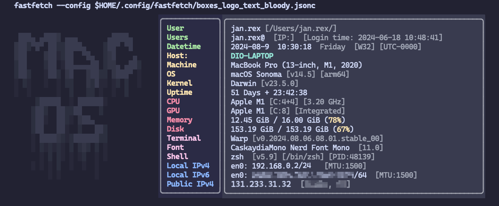

# My Fastfetch config
Welcome to my unique fastfetch config repo.

**NEWS**: Now in Fastfecth (>2.25.0), my config is included in the preset examples; it is number 24! https://github.com/fastfetch-cli/fastfetch/discussions/1269

**** is multiplatform command-line tool designed to display system information in a visually appealing way, similar to Neofetch. It is lightweight, fast, and highly configurable, allowing users to fetch details like operating system, kernel version, CPU, memory, and more, and then present this information in a structured format with customizable themes. Fastfetch is particularly appreciated for its speed and minimal resource usage compared to similar tools.

My fastfetch configuration is unique in the sense that I couldn’t find similar presets, either in the examples or from other people, especially when looking for background colors.

Similarly, the .jsonc configuration files contain comments that explain the use of color settings, as well as details about the formats of the modules.

I have uploaded my configuration so that it can be downloaded, modified, or the repository can be cloned.🫰


## Screenshots
**Screenshot with logo**:


**Screenshot without logo**:


:gift: **Screenshots logo text ASCII Art** (new):





## Tested
The config is only tested on:
  * :white_check_mark: Alacritty (macOS)
  * :white_check_mark: iTerm2 (macOS)
  * :white_check_mark: Kitty (macOS)
  * :white_check_mark: [Warp](https://app.warp.dev/referral/DX5RRZ) (macOS)
  * :white_check_mark: Wezterm (macOS)
  * :warning: ~~Terminal (macOS)~~ (The colors do not show correctly)


## Requirements
  * Console app `fastfetch`
  
  * Path for Fastfecth _config_ and presets on macOS: `/Users/$USER/.config/fastfetch/`
    * Paths for Fastfetch config on macOS: (`fastfetch --list-config-paths`)
      * `/Users/$USER/.config/fastfetch/` :white_check_mark:
      * `/Users/$USER/Library/Preferences/fastfetch/`
      * `/Users/$USER/Library/Application Support/fastfetch/`
      * `/Users/$USER/fastfetch/`
      * `/etc/fastfetch/`
      * `/opt/homebrew/etc/fastfetch/`

    * Paths for Fastfetch _presets_ on macOS: (`fastfetch --list-data-paths`)
      * `/Users/$USER/.local/share/fastfetch/`
      * `/opt/homebrew/Cellar/fastfetch/2.21.0/share/fastfetch`
      * `/Users/$USER/Library/Application Support/fastfetch/`
      * `/Users/$USER/fastfetch/`
      * `/usr/local/share/fastfetch/`
      * `/usr/share/fastfetch/`

## Installation

In macOS:

    brew install fastfetch

Create a temp folder and change to it:

    mkdir $HOME/tempgit
    
Clone the repo:

    git clone https://github.com/jan-rex/my-fastfetch-config.git $HOME/tempgit

Copy _fastfetch_ folder to _$HOME/.config/_ and adjust permissions

    cp -r $HOME/tempgit/fastfetch $HOME/.config/
    chmod -R 750 $HOME/.config/fastfetch
    
Delete temp folder
    
    rm -fr $HOME/tempgit

The files `*.jsonc` can be modified to suit specific requirements

    vim $HOME/.config/fastfetch/boxes_logo.jsonc
    vim $HOME/.config/fastfetch/boxes_nologo.jsonc
    vim $HOME/.config/fastfetch/boxes_logo_text_ansi_shadow.jsonc
    vim $HOME/.config/fastfetch/boxes_logo_text_bloody.jsonc
    vim $HOME/.config/fastfetch/boxes_logo_text_blurvision-ascii.jsonc

Usage and test the config presets

    fastfetch --config $HOME/.config/fastfetch/boxes_logo.jsonc
    fastfetch --config $HOME/.config/fastfetch/boxes_nologo.jsonc
    fastfetch --config $HOME/.config/fastfetch/boxes_logo_text_ansi_shadow.jsonc
    fastfetch --config $HOME/.config/fastfetch/boxes_logo_text_bloody.jsonc
    fastfetch --config $HOME/.config/fastfetch/boxes_logo_text_blurvision-ascii.jsonc

## Configure ZSH for execute fastfetch at startup

Modify your file `.zshrc`

    vim $HOME/.zshrc

Add the content

```sh
# ======================================
# EXECUTIONS
# --------------------------------------
# FASTFETCH
fastfetch --config $HOME/.config/fastfetch/boxes_logo.jsonc
# fastfetch --config $HOME/.config/fastfetch/boxes_nologo.jsonc
# fastfetch --config $HOME/.config/fastfetch/boxes_logo_text_ansi_shadow.jsonc
# fastfetch --config $HOME/.config/fastfetch/boxes_logo_text_bloody.jsonc
# fastfetch --config $HOME/.config/fastfetch/boxes_logo_text_blurvision-ascii.jsonc
# ======================================
```
